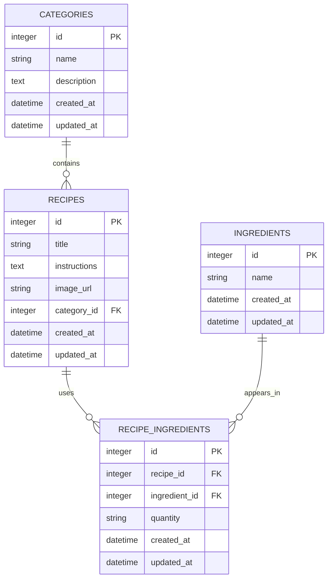

# FoodieHub Database ERD

```mermaid
erDiagram
    CATEGORIES ||--o{ RECIPES : contains
    RECIPES ||--o{ RECIPE_INGREDIENTS : uses
    INGREDIENTS ||--o{ RECIPE_INGREDIENTS : appears_in

    CATEGORIES {
        integer id PK
        string name
        text description
        datetime created_at
        datetime updated_at
    }

    RECIPES {
        integer id PK
        string title
        text instructions
        string image_url
        integer category_id FK
        datetime created_at
        datetime updated_at
    }

    INGREDIENTS {
        integer id PK
        string name
        datetime created_at
        datetime updated_at
    }

    RECIPE_INGREDIENTS {
        integer id PK
        integer recipe_id FK
        integer ingredient_id FK
        string quantity
        datetime created_at
        datetime updated_at
    }
```
